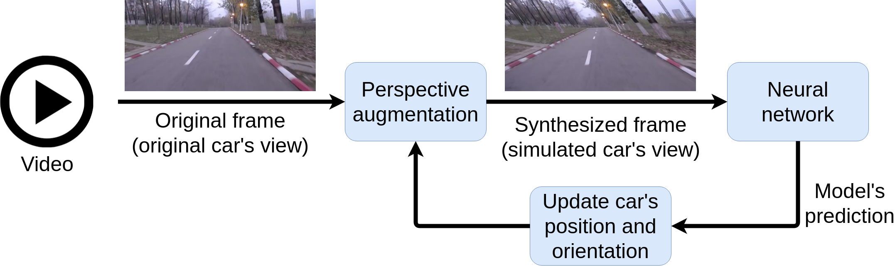

# Steering-Evaluator-3
<p align='center'>
  
</p>

<p align='center'>
  
</p>

<p align='center'>
  
</p>

<p align='center'>
  
</p>


## Pre-requisits
```shell
mkdir -p pipeline/models/monodepth
cd pipeline/models/monodepth
```
For monodepth, download the pre-trained models from <a href='https://drive.google.com/drive/folders/18kTR4PaRlQIeEFJ2gNkiXYnFcTfyrRNH?usp=sharing'>here</a>

```shell
mkdir -p pipeline/models/inpaint
cd pipeline/models/inpaint
```
For the inpaint, download the pre-trained model from <a href='https://drive.google.com/drive/folders/1oeVxVnR5BIZ1QM-ClY6Xa4CogxTQzmZx?usp=sharing'>here</a>

```shell
mkdir -p pipeline/models/flow
cd pipeline/models/flow
```
For optical flow, download the pre-trained model from <a href='https://drive.google.com/drive/folders/1sahN3m6salz64fG8XFGuA0vYklkWYMNu?usp=sharing'>here</a>


## Create dataset

```shell
mkdir raw_dataset
```

* Download the UBP dataset into the "raw_dataset" directory. A sample of the UPB dataset is available <a href="https://drive.google.com/drive/folders/1p_2-_Xo-Wd9MCnkYqPfGyKs2BnbeApqn?usp=sharing">here</a>.

```shell
mkdir scene_splits
```

* Download the scene splits into the "scene_splits" directory. The train-validation split is available <a href="https://github.com/RobertSamoilescu/UPB-Dataset-Split">here</a>.
In the "scene_splits" directory you should have: "train_scenes.txt" and "test_scenes.txt".

## Train

* Train models using <a href='https://github.com/RobertSamoilescu/Steering-Network-2'>this repo</a>.
```shell
mkdir ckpts
```
* The trained models are in the "snapshots" folder (in the above repo). Copy the directories from the "snapshots" folder to "ckpts" folder.


## Test - Closed-loop evaluation
```shell
./multiple_runs.sh
```


## Results - Closed-loop evaluation

|Model      |Disp   |Depth    |Flow   |A    |NI   |MAD/MSTI   |MAA/MSTI   |VL+P     |
|-----------|-------|---------|-------|-----|-----|-----------|-----------|---------|
|Baseline_0 | *     | *       | *     | 0.45| 620 | 0.0277    | 0.2390    | 6780.16 |
|Baseline_1 | *     | *       | *     | 0.69| 228 | 0.0107    | 0.0675    | 4428.16 |
|ResNet18   | No    | No      | No    | 0.71| 213 | 0.0102    | 0.0637    | 4338.16 |
|ResNet18   | No    | Yes     | No    | 0.71| 211 | 0.0101    | 0.0631    | 4326.16 |
|ResNet18   | Yes   | No      | No    | 0.71| 204 | 0.0103    | 0.0583    | 4284.16 |
|ResNet18   | Yes   | No      | Yes   | 0.70| 216 | 0.0111    | 0.0661    | 4356.16 |

Closed-loop evaluation using 3D perspective augmentation over $3060.16$[s]. The model receives as input an RGB image, speed, disparity/depth map, and optical flow. Data balancing is applied during training. $Baseline_0$ corresponds to the model that always predicts $0^{\circ}$, and $Baseline_1$ corresponds to the $ResNet18$ model trained on the raw dataset without perspective augmentation or data balancing. Abbreviations: autonomy (A), number of interventions (NI), mean absolute distance (MAD), mean absolute angle (MAA), mean steps till intervention (MSTI), video length (VL), penalty(P). * means not applicable.


## View intervention points
```shell
python3 view.py
```

<p align='center'>
   
</p>
